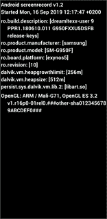

# Geofencer 
[](https://app.bitrise.io/app/62c5e7d6d14d57dd) [  ](https://bintray.com/exozetag/maven/Geolocator/_latestVersion) [](https://jitpack.io/#exozet/Geolocator)
[](https://android-arsenal.com/api?level=15) [](https://docs.gradle.org/current/release-notes) [](https://kotlinlang.org/) [](https://android-arsenal.com/details/1/7860)

Convience library to receive user location updates and geofence events with minimal effort. 

Features:

- supports Android-Q
- receive updates on background
- receive updates if app got killed
- geofence updates (dwell, enter, exit)
- location updates
- configurable update intervals


     
### Requirmenets

1. Location permissions in [*AndroidManifest.xml*](app/src/main/AndroidManifest.xml#L8-L9)

	    <uses-permission android:name="android.permission.ACCESS_FINE_LOCATION" />
   	 	<uses-permission android:name="android.permission.ACCESS_COARSE_LOCATION" />
   	 	
2. Google maps api key

		<string name="google_maps_key" templateMergeStrategy="preserve" translatable="false">YOUR_KEY</string>
	
### How to use

### Geofence

1. Create [Receiver](app/src/main/java/com/sprotte/geolocator/demo/kotlin/GeofenceIntentService.kt)

```kotlin
class GeofenceIntentService : GeofenceIntentService() {
	
    override fun onGeofence(geofence: Geofence) {
    	Log.v(GeoFenceIntentService::class.java.simpleName, "onGeofence $geofence")	    
    }
}
```		
2. Add receiver to your [manifest](app/src/main/AndroidManifest.xml#L45-L47)

	 	<service
            android:name=".kotlin.GeoFenceIntentService"
            android:permission="android.permission.BIND_JOB_SERVICE" />

3. [Start geofence tracking](app/src/main/java/com/sprotte/geolocator/demo/kotlin/MainActivity.kt#L33-L46)

```kotlin
val geofence = Geofence(
    id = UUID.randomUUID().toString(),
    latitude = 51.0899232,
    longitude = 5.968358,
    radius = 30.0,
    title = "Germany",
    message = "Entered Germany",
    transitionType = GEOFENCE_TRANSITION_ENTER
)
    
Geofencer(this).addGeofence(geofence, GeoFenceIntentService::class.java) { /* successfully added geofence */ }
```
### Location Tracker

1. Create [Receiver](app/src/main/java/com/sprotte/geolocator/demo/kotlin/LocationTrackerService.kt)

```kotlin
class LocationTrackerService : LocationTrackerUpdateIntentService() {

	override fun onLocationResult(locationResult: LocationResult) {  
		Log.v(GeoFenceIntentService::class.java.simpleName, "onLocationResult $location")
  }
}
```
2. Add receiver to [manifest](app/src/main/AndroidManifest.xml#L49-L51)

		<service
            android:name=".kotlin.LocationTrackerService"
            android:permission="android.permission.BIND_JOB_SERVICE" />

3. [Start tracking](app/src/main/java/com/sprotte/geolocator/demo/kotlin/MainActivity.kt#L48-L51)

```kotlin
LocationTracker.requestLocationUpdates(this, LocationTrackerService::class.java)
```

4. Stop tracking

```kotlin
LocationTracker.removeLocationUpdates(requireContext())
```

### How to use in Java

### Geofence

1. Create [Receiver](app/src/main/java/com/sprotte/geolocator/demo/java/GeofenceIntentService.java)

```java
public class GeoFenceIntentService extends GeofenceIntentService {
	
	@Override
	public void onGeofence(@NotNull Geofence geofence) {
	
    	Log.v(GeoFenceIntentService.class.getSimpleName(), "onGeofence " + geofence);	    	
   	}
}
```		
2. Add receiver to your [manifest](app/src/main/AndroidManifest.xml#L63-L65)

	 	<service
            android:name=".java.GeoFenceIntentService"
            android:permission="android.permission.BIND_JOB_SERVICE" />

3. [Start geofence tracking](app/src/main/java/com/sprotte/geolocator/demo/java/AddGeoFenceActivity.java#L48-L63)

```java
Geofence geofence = new Geofence(
        UUID.randomUUID().toString(),
        51.0899232,
        5.968358,
        30.0,
        "Germany",
        "Entered Germany",
        GEOFENCE_TRANSITION_ENTER);
Geofencer geofencer = new Geofencer(this);
geofencer.addGeofence(geofence, GeoFenceIntentService.class,
   	 () -> /* successfully added geofence */ Unit.INSTANCE);        	 
```
### Location Tracker

1. Create [Receiver](app/src/main/java/com/sprotte/geolocator/demo/java/LocationTrackerService.java)

```java
public class LocationTrackerService extends LocationTrackerUpdateIntentService {

    @Override
    public void onLocationResult(@NotNull LocationResult location) {
	
        Log.v(GeoFenceIntentService.class.getSimpleName(), "onLocationResult " + location);		        );
    }
}
```	

2. Add receiver to [manifest](app/src/main/AndroidManifest.xml#L66-L68)

		<service
            android:name=".java.LocationTrackerService"
            android:permission="android.permission.BIND_JOB_SERVICE" />

3. [Start tracking](https://github.com/exozet/Geolocator/blob/master/app/src/main/java/com/sprotte/geolocator/demo/java/AddGeoFenceActivity.java#L65-L68)

```java
LocationTracker.INSTANCE.requestLocationUpdates(this, LocationTrackerService.class);
```

4. Stop tracking

```java
LocationTracker.INSTANCE.removeLocationUpdates(this);
```

### How to install

#### jCenter / mavenCentral

	implementation 'com.sprotte:Geolocator:latest'

#### or Jiptack

##### Step 1. Add the JitPack repository to your build file

Add it in your root build.gradle at the end of repositories:

	allprojects {
		repositories {
			maven { url 'https://jitpack.io' }
		}
	}
##### Step 2. Add the dependency

	dependencies {
		implementation 'com.github.exozet:Geolocator:latest'
	}
	
### Configuration

Default Location tracking update intervals can be overriden, by adding following parameter into your _app/res/_ - folder, e.g. [**app/res/config.xml**](app/src/main/res/values/config.xml#L4-L7)

    <integer name="location_update_interval_in_millis">0</integer>
    <integer name="location_fastest_update_interval_in_millis">0</integer>
    <integer name="location_max_wait_time_interval_in_millis">0</integer>
    <integer name="location_min_distance_for_updates_in_meters">0</integer>

### Known Issues

- does not work when in doze mode [#2](https://github.com/exozet/Geolocator/issues/2)


### Contributors

[Jan Rabe](jan.rabe@exozet.com)

[Paul Sprotte](paul.sprotte@exozet.com)
